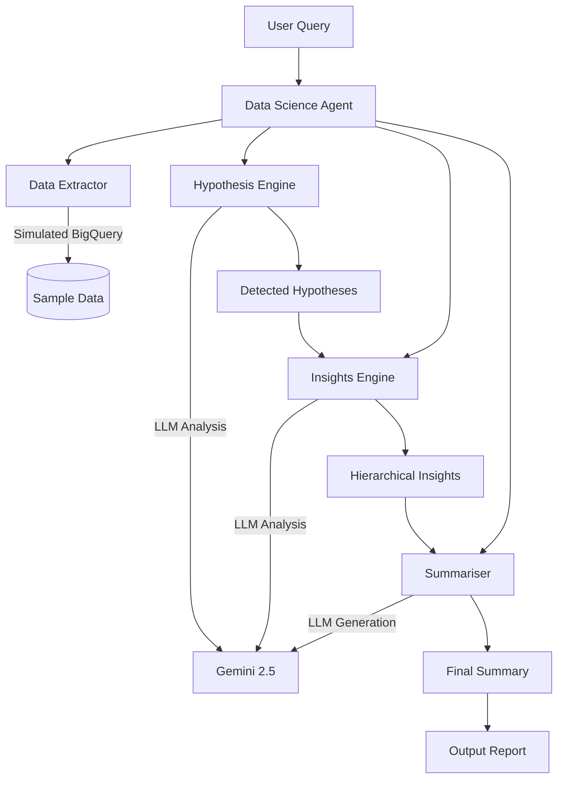
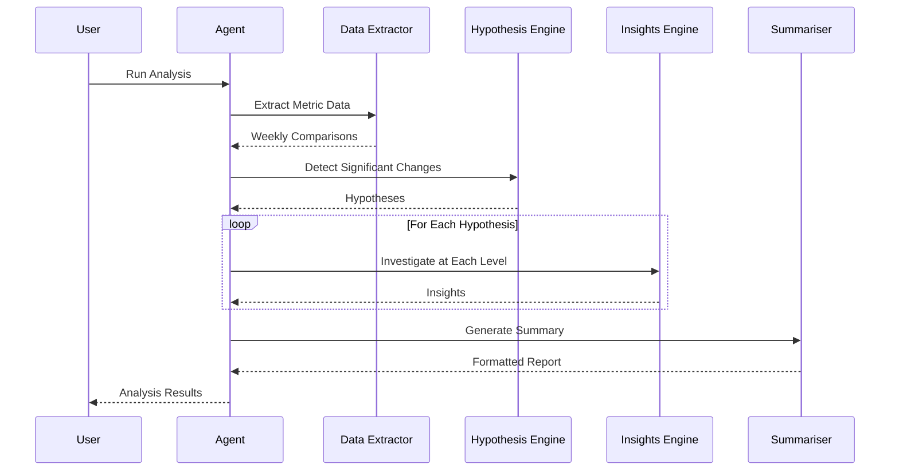

# Woolworths Data Science Agent

A modular data science agent for analyzing supermarket operational metrics. Built with Python, LangChain, and Google Gemini, this agent automates the detection, investigation, and summarization of significant business metric changes.

## Overview

This agent provides automated analytics for Woolworths Australia supermarket operations, featuring:

- **Hypothesis Detection**: Automatically identifies significant week-over-week changes, budget variances, and trend anomalies
- **Hierarchical Investigation**: Drills through organizational levels to find root causes
- **Audience-Specific Summaries**: Generates tailored reports for executives, analysts, and operations teams
- **Flexible Summarization**: General-purpose content summarization with tone and expertise adaptation

## Architecture



## Workflow



## Installation

### Prerequisites

- Python 3.11+
- Google Gemini API key (optional, for LLM-powered analysis)

### Setup

```bash
# Clone or navigate to the project
cd data-science-agent

# Create virtual environment
python -m venv venv
source venv/bin/activate  # On Windows: venv\Scripts\activate

# Install dependencies
pip install -r requirements.txt

# Set up environment variables (optional, for LLM mode)
echo "GEMINI_API_KEY=your_api_key_here" > .env
```

## Usage

### Quick Start

```bash
# Run demo workflow (no LLM required)
python main.py --demo

# Run with Gemini LLM
python main.py --demo --use-llm

# Quick scan for critical issues
python main.py --quick-scan

# Generate sample data only
python main.py --generate-data
```

### Programmatic Usage

```python
from agent.data_science_agent import DataScienceAgent
from models.data_models import MetricType, HierarchyLevel

# Initialize agent
agent = DataScienceAgent(use_llm=False)  # Set True for LLM mode

# Run full analysis
result = agent.run_full_analysis(
    metrics=[MetricType.SALES, MetricType.WAGES],
    hierarchy_level=HierarchyLevel.STORE,
    audience="executive",
    tone="formal"
)

# Access results
print(result.summary.executive_summary)
for finding in result.summary.key_findings:
    print(f"- {finding.title}: {finding.description}")

# Generate report
report = agent.generate_report(result, format_type="markdown")
```

### Standalone Summarizer

```python
from agent.data_science_agent import DataScienceAgent

agent = DataScienceAgent(use_llm=True)

summary = agent.summarise_content(
    content="Your content here...",
    audience_goal="Understand key trends",
    expertise="medium",  # low, medium, high
    tone="conversational"  # formal, conversational, urgent, encouraging
)

print(summary.summary)
print(summary.key_points)
```

## Project Structure

```
data-science-agent/
├── config/
│   ├── settings.py          # Configuration management
│   └── prompts/              # LLM prompt templates
│       ├── hypothesis.yaml
│       ├── insights.yaml
│       ├── summary.yaml
│       └── summariser.yaml
├── data/
│   ├── generator.py          # Simulated data generator
│   └── sample_data/          # Generated CSV files
├── models/
│   ├── data_models.py        # Core data structures
│   ├── llm_inputs.py         # LLM input models
│   └── llm_outputs.py        # LLM output models
├── clients/
│   ├── base_client.py        # Base Gemini client
│   ├── hypothesis_client.py  # Hypothesis detection client
│   ├── insights_client.py    # Insights generation client
│   ├── summary_client.py     # Summary generation client
│   └── summariser_client.py  # General summariser client
├── tools/
│   ├── data_extractor.py     # Simulated BigQuery interface
│   ├── hypothesis_engine.py  # Hypothesis detection logic
│   ├── insights_engine.py    # Hierarchical investigation
│   └── summariser.py         # Summarization tool
├── agent/
│   └── data_science_agent.py # Main orchestration agent
├── utils/
│   ├── response_parser.py    # LLM response parsing
│   └── metrics.py            # Statistical calculations
└── main.py                   # Entry point
```

## Metrics Analyzed

| Metric | Description | Target Direction |
|--------|-------------|------------------|
| **Wages** | Labor cost as % of sales | Lower is better |
| **Voice of Customer** | Customer satisfaction (0-100) | Higher is better |
| **Sales** | Total revenue in AUD | Higher is better |
| **Stockloss** | Inventory shrinkage % | Lower is better |
| **Order Pickrate** | Online fulfillment rate | Higher is better |

## Hierarchy Levels

The agent analyzes data across organizational hierarchy:

```
National
    └── Zone (6 zones)
        └── State (8 states/territories)
            └── Group (~50 store groups)
                └── Store (~100 stores in demo)
                    └── Category (20 product categories)
```

## Configuration

Key settings in `config/settings.py`:

```python
# Significance thresholds
THRESHOLDS = {
    "wow_change_pct": 5.0,      # Week-over-week change threshold
    "budget_variance_pct": 3.0, # Budget variance threshold
    "trend_deviation_pct": 10.0 # Trend anomaly threshold
}

# Model settings
MODEL_NAME = "gemini-2.5-flash-lite"
TEMPERATURE_ANALYTICAL = 0.1
TEMPERATURE_CREATIVE = 0.7
```

## Output Formats

### Executive Summary
High-level findings with financial impact and strategic recommendations.

### Analyst Report
Detailed methodology, statistical significance, and follow-up analysis suggestions.

### Operations Summary
Specific store/category issues with actionable steps and ownership.

### Alert
Urgent notifications for critical findings requiring immediate action.

## Development

### Running Tests

```bash
pytest tests/
```

### Adding New Metrics

1. Add to `MetricType` enum in `models/data_models.py`
2. Add configuration in `config/settings.py`
3. Update data generator in `data/generator.py`

### Customizing Prompts

Edit YAML files in `config/prompts/` to modify LLM behavior.

## API Reference

### DataScienceAgent

```python
class DataScienceAgent:
    def run_full_analysis(...) -> AnalysisResult
    def quick_scan() -> Dict
    def analyze_single_metric(metric, level) -> AnalysisResult
    def summarise_content(content, audience_goal, ...) -> SummariserOutput
    def generate_report(result, format_type) -> str
```

### AnalysisResult

```python
@dataclass
class AnalysisResult:
    analysis_date: date
    hypotheses_output: HypothesisEngineOutput
    investigations: List[InsightsEngineOutput]
    summary: SummaryOutput
    alert: Optional[Dict]
    metrics: Dict

    @property
    def has_critical_findings(self) -> bool

    @property
    def top_recommendations(self) -> List[str]
```

## License

MIT License

## Contributing

Contributions welcome. Please ensure all Pydantic models are properly typed and tests pass before submitting PRs.
